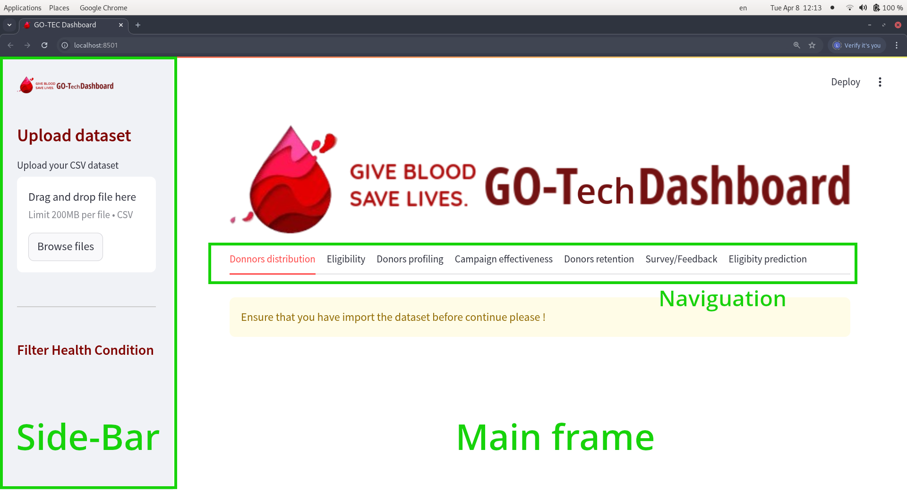

# Prerequisites

Upload the project, open it in a terminal go into the folder script and run:

```sh
streamlit run dash_app.py
```

the dashboard show in your web navigator is a fully interactive dashboard made to be intuitive for the user.</br>
It is compose of two parts the main part which is showing you information from data and the sidebar used to give you
more access to what you may want.</br>
The central part contain the navigatio to naviguate amoung different otions and under the navigation you have the part to see the different informations.



## Upload the dataset.
To ensure you have upload the dataset on which you want to extract information you get a customise message which indicates that first we need to load the dataset.</br>
To upload the dataset you will need to go in the sidebar and click on the upload button to load your <b style="font-size:15px;">.csv</b> file.</br>
After the data been load you will start get information in the main part of the dashboard.</br>
Each of the tab in the nav contains specifique information on each on the proposing question. As tab we get the :
- <b style="font-size:15px;">Donors distributions</b> : which show the distribution of the candidates over the different arrondissement in the dataset.
- <b style="font-size:15px;">The Eligibility</b> : this tab give you information on the different proportion of candidate according to different heath condition which impat the eligibility.  
- <b style="font-size:15px;">Donors profiling</b>:  here we study the different profile of each donos and build some cluster base on similar information.
- <b style="font-size:15px;">campaign effectiveness</b>: here we give you insights on the different ongoing facts all over the donation campaign duration. 
- <b style="font-size:15px;">Eligibility prediction</b>: in this last section you can get the prediction of some one from who you have collected data.

# Donors distribution
Putting the cursor on the map gives the number of donors in each department and increasing or tapping on the map outputs the distribution of selected quarter in the map showing eligibility and non-eligibility.

# Eligibility 
Next moving to the which is the eligibility Tab gives information about the number of donors. We have a filter which gives us the opportunity to move between the three unique values of ELIGIBLE AU DON. When we choose the health conditions for definitely non eligible it will display no eligible donors
when temporary non eligible is taken it will display the number of non eligible per in total number of non eligible

# Ideal Donor Profile
Here we still choose variable related to eligibility and select features we want to include in our clusters. the cluster with the highest number of eligible donors is considered and later eligibility score computer. The average age of the best donors is outputted which indicates the best donors related to our clusters

# Campaign effectiveness

This portion analyses the monthly, weekly and daily distributions of blood donations and also identifies the top ten donation periods.

# Donor Retention

This portion reveals to us how often those who have given blood come back for blood donation. The plots which are interactive give insights based on the different features

# Model Prediction API

This repository contains code for training a machine learning model, saving the model, and making predictions using a Flask API. The API allows users to send data and receive predictions.

## Prerequisites

- Python 3.10 or higher
- pip (Python package installer)

## Installation

1. **Clone the repository**:

   ```sh
   git clone https://github.com/nguefackuriel/IndabaX-Cameroon-2025.git
   cd IndabaX-Cameroon-2025
   ```

2. **Create a virtual environment** (optional but recommended):

   ```sh
   python -m venv venv
   source venv/bin/activate  # On Windows use `venv\Scripts\activate`
   ```

3. **Install the required libraries**:

   ```sh
   pip install -r requirements.txt
   ```

4. **Download the Textblob corpora for Sentiment Analysis**

   ```sh
   python -m textblob.download_corpora
   ```

## Training the Model

1. **Prepare your data**: Ensure the data ml_data_2019.xlsx is in the folder.

2. **Train the model**: Run the training script to train the model and save it along with the preprocessor and label encoder.

   ```sh
   python train.py
   ```

   This script will:

   - Load the data
   - Preprocess the data
   - Train the model
   - Save the model, preprocessor, and label encoder to a file named [model_pipeline.pkl](https://github.com/nguefackuriel/IndabaX-Cameroon-2025/blob/main/model_pipeline.pkl)

## Running the Flask API

1. **Start the Flask server**:

   ```sh
   python app.py
   ```

   This will start the Flask server on `http://127.0.0.1:5001`.

## Making Predictions on the Web App

1. **Donor Status Prediction**: Go to the "Donor Status Prediction" tab to make prediction on the Web App.

2. In the Input Data form, enter your data in a JSON format following the format below, you can just copy and paste it, and change the value of features.

   ```json
   {
     "ID": "DONOR_2788",
     "Age": 28,
     "Horodateur": "24:18.6",
     "Niveau_d'etude": "Universitaire",
     "Genre_": "Homme",
     "Taille_": null,
     "Poids": null,
     "Situation_Matrimoniale_(SM)": "Célibataire",
     "Profession_": "Etudiant (e)",
     "Arrondissement_de_résidence_": "Douala 3",
     "Quartier_de_Résidence_": "Ndogbon",
     "Nationalité_": "Camerounaise",
     "Religion_": "Chretien (Catholique)",
     "A-t-il_(elle)_déjà_donné_le_sang_": "Non",
     "Si_oui_preciser_la_date_du_dernier_don._": null,
     "Taux_d’hémoglobine_": null,
     "Raison_indisponibilité__[Est_sous_anti-biothérapie__]": null,
     "Raison_indisponibilité__[Taux_d’hémoglobine_bas_]": null,
     "Raison_indisponibilité__[date_de_dernier_Don_<_3_mois_]": null,
     "Raison_indisponibilité__[IST_récente_(Exclu_VIH,_Hbs,_Hcv)]": null,
     "Date_de_dernières_règles_(DDR)__": null,
     "Raison_de_l’indisponibilité_de_la_femme_[La_DDR_est_mauvais_si_<14_jour_avant_le_don]": null,
     "Raison_de_l’indisponibilité_de_la_femme_[Allaitement_]": null,
     "Raison_de_l’indisponibilité_de_la_femme_[A_accoucher_ces_6_derniers_mois__]": null,
     "Raison_de_l’indisponibilité_de_la_femme_[Interruption_de_grossesse__ces_06_derniers_mois]": null,
     "Raison_de_l’indisponibilité_de_la_femme_[est_enceinte_]": null,
     "Autre_raisons,__preciser_": null,
     "Sélectionner_\"ok\"_pour_envoyer_": null,
     "Raison_de_non-eligibilité_totale__[Antécédent_de_transfusion]": null,
     "Raison_de_non-eligibilité_totale__[Porteur(HIV,hbs,hcv)]": null,
     "Raison_de_non-eligibilité_totale__[Opéré]": null,
     "Raison_de_non-eligibilité_totale__[Drepanocytaire]": null,
     "Raison_de_non-eligibilité_totale__[Diabétique]": null,
     "Raison_de_non-eligibilité_totale__[Hypertendus]": null,
     "Raison_de_non-eligibilité_totale__[Asthmatiques]": null,
     "Raison_de_non-eligibilité_totale__[Cardiaque]": null,
     "Raison_de_non-eligibilité_totale__[Tatoué]": null,
     "Raison_de_non-eligibilité_totale__[Scarifié]": null,
     "Si_autres_raison_préciser_": null
   }
   ```

3. Click on the "Submit" button to get the prediction.

## Making Predictions using Postman

1. **Open Postman**: If you don't have Postman installed, you can download it from [Postman's official website](https://www.postman.com/downloads/).

2. **Create a new request**:

   - Click on the "New" button, then select "Request".
   - Name your request (e.g., "Model Prediction") and save it to a collection if you have one, or create a new collection.

3. **Set up the request**:

   - Set the request type to `POST`.
   - Enter the URL for your Flask API endpoint: `http://127.0.0.1:5001/predict`.

4. **Set the request headers**:

   - Click on the "Headers" tab.
   - Add a new header with the key `Content-Type` and the value `application/json`.

5. **Set the request body**:

   - Click on the "Body" tab.
   - Select the "raw" radio button.
   - Ensure the format is set to `JSON` (application/json).
   - Enter the JSON data that your model expects. For example:

   ```json
   {
     "ID": "DONOR_2788",
     "Age": 28,
     "Horodateur": "24:18.6",
     "Niveau_d'etude": "Universitaire",
     "Genre_": "Homme",
     "Taille_": null,
     "Poids": null,
     "Situation_Matrimoniale_(SM)": "Célibataire",
     "Profession_": "Etudiant (e)",
     "Arrondissement_de_résidence_": "Douala 3",
     "Quartier_de_Résidence_": "Ndogbon",
     "Nationalité_": "Camerounaise",
     "Religion_": "Chretien (Catholique)",
     "A-t-il_(elle)_déjà_donné_le_sang_": "Non",
     "Si_oui_preciser_la_date_du_dernier_don._": null,
     "Taux_d’hémoglobine_": null,
     "Raison_indisponibilité__[Est_sous_anti-biothérapie__]": null,
     "Raison_indisponibilité__[Taux_d’hémoglobine_bas_]": null,
     "Raison_indisponibilité__[date_de_dernier_Don_<_3_mois_]": null,
     "Raison_indisponibilité__[IST_récente_(Exclu_VIH,_Hbs,_Hcv)]": null,
     "Date_de_dernières_règles_(DDR)__": null,
     "Raison_de_l’indisponibilité_de_la_femme_[La_DDR_est_mauvais_si_<14_jour_avant_le_don]": null,
     "Raison_de_l’indisponibilité_de_la_femme_[Allaitement_]": null,
     "Raison_de_l’indisponibilité_de_la_femme_[A_accoucher_ces_6_derniers_mois__]": null,
     "Raison_de_l’indisponibilité_de_la_femme_[Interruption_de_grossesse__ces_06_derniers_mois]": null,
     "Raison_de_l’indisponibilité_de_la_femme_[est_enceinte_]": null,
     "Autre_raisons,__preciser_": null,
     "Sélectionner_\"ok\"_pour_envoyer_": null,
     "Raison_de_non-eligibilité_totale__[Antécédent_de_transfusion]": null,
     "Raison_de_non-eligibilité_totale__[Porteur(HIV,hbs,hcv)]": null,
     "Raison_de_non-eligibilité_totale__[Opéré]": null,
     "Raison_de_non-eligibilité_totale__[Drepanocytaire]": null,
     "Raison_de_non-eligibilité_totale__[Diabétique]": null,
     "Raison_de_non-eligibilité_totale__[Hypertendus]": null,
     "Raison_de_non-eligibilité_totale__[Asthmatiques]": null,
     "Raison_de_non-eligibilité_totale__[Cardiaque]": null,
     "Raison_de_non-eligibilité_totale__[Tatoué]": null,
     "Raison_de_non-eligibilité_totale__[Scarifié]": null,
     "Si_autres_raison_préciser_": null
   }
   ```

   The json above is an example that should give you a prediction "Eligible".
   You can replace the values to see what you got.

   Example of json that should give you "Temporairement Non-eligible"

   ```json
   {
     "ID": "DONOR_2788",
     "Age": 23,
     "Horodateur": "44:19.0",
     "Niveau_d'etude": "Universitaire",
     "Genre_": "Homme",
     "Taille_": null,
     "Poids": null,
     "Situation_Matrimoniale_(SM)": "Célibataire",
     "Profession_": "Sans Emplois",
     "Arrondissement_de_résidence_": "R A S",
     "Quartier_de_Résidence_": "R A S",
     "Nationalité_": "R A S",
     "Religion_": "Chretien (Catholique)",
     "A-t-il_(elle)_déjà_donné_le_sang_": "Oui",
     "Si_oui_preciser_la_date_du_dernier_don._": "1/1/2017 0:00",
     "Taux_d’hémoglobine_": "10.8",
     "Raison_indisponibilité__[Est_sous_anti-biothérapie__]": null,
     "Raison_indisponibilité__[Taux_d’hémoglobine_bas_]": null,
     "Raison_indisponibilité__[date_de_dernier_Don_<_3_mois_]": null,
     "Raison_indisponibilité__[IST_récente_(Exclu_VIH,_Hbs,_Hcv)]": null,
     "Date_de_dernières_règles_(DDR)__": null,
     "Raison_de_l’indisponibilité_de_la_femme_[La_DDR_est_mauvais_si_<14_jour_avant_le_don]": null,
     "Raison_de_l’indisponibilité_de_la_femme_[Allaitement_]": null,
     "Raison_de_l’indisponibilité_de_la_femme_[A_accoucher_ces_6_derniers_mois__]": null,
     "Raison_de_l’indisponibilité_de_la_femme_[Interruption_de_grossesse__ces_06_derniers_mois]": null,
     "Raison_de_l’indisponibilité_de_la_femme_[est_enceinte_]": null,
     "Autre_raisons,__preciser_": null,
     "Sélectionner_\"ok\"_pour_envoyer_": null,
     "Raison_de_non-eligibilité_totale__[Antécédent_de_transfusion]": "Non",
     "Raison_de_non-eligibilité_totale__[Porteur(HIV,hbs,hcv)]": "Non",
     "Raison_de_non-eligibilité_totale__[Opéré]": "Oui",
     "Raison_de_non-eligibilité_totale__[Drepanocytaire]": "Non",
     "Raison_de_non-eligibilité_totale__[Diabétique]": "Non",
     "Raison_de_non-eligibilité_totale__[Hypertendus]": "Non",
     "Raison_de_non-eligibilité_totale__[Asthmatiques]": "Non",
     "Raison_de_non-eligibilité_totale__[Cardiaque]": "Non",
     "Raison_de_non-eligibilité_totale__[Tatoué]": "Non",
     "Raison_de_non-eligibilité_totale__[Scarifié]": "Non",
     "Si_autres_raison_préciser_": null
   }
   ```

   Example of json that should give you "Définitivement non-eligible"

   ```json
   {
     "ID": "DONOR_2788",
     "Age": 46,
     "Horodateur": "02:58.2",
     "Niveau_d'etude": "Pas Précisé",
     "Genre_": "Homme",
     "Taille_": null,
     "Poids": null,
     "Situation_Matrimoniale_(SM)": "Marié (e)",
     "Profession_": "ELECTRICIEN",
     "Arrondissement_de_résidence_": "Douala 3",
     "Quartier_de_Résidence_": "NDOGPOSSI",
     "Nationalité_": "Camerounaise",
     "Religion_": "Chretien (Catholique)",
     "A-t-il_(elle)_déjà_donné_le_sang_": "Non",
     "Si_oui_preciser_la_date_du_dernier_don._": "1/1/0001",
     "Taux_d’hémoglobine_": null,
     "Raison_indisponibilité__[Est_sous_anti-biothérapie__]": null,
     "Raison_indisponibilité__[Taux_d’hémoglobine_bas_]": "Oui",
     "Raison_indisponibilité__[date_de_dernier_Don_<_3_mois_]": null,
     "Raison_indisponibilité__[IST_récente_(Exclu_VIH,_Hbs,_Hcv)]": null,
     "Date_de_dernières_règles_(DDR)__": null,
     "Raison_de_l’indisponibilité_de_la_femme_[La_DDR_est_mauvais_si_<14_jour_avant_le_don]": null,
     "Raison_de_l’indisponibilité_de_la_femme_[Allaitement_]": null,
     "Raison_de_l’indisponibilité_de_la_femme_[A_accoucher_ces_6_derniers_mois__]": null,
     "Raison_de_l’indisponibilité_de_la_femme_[Interruption_de_grossesse__ces_06_derniers_mois]": null,
     "Raison_de_l’indisponibilité_de_la_femme_[est_enceinte_]": null,
     "Autre_raisons,__preciser_": null,
     "Sélectionner_\"ok\"_pour_envoyer_": "Ok",
     "Raison_de_non-eligibilité_totale__[Antécédent_de_transfusion]": null,
     "Raison_de_non-eligibilité_totale__[Porteur(HIV,hbs,hcv)]": null,
     "Raison_de_non-eligibilité_totale__[Opéré]": null,
     "Raison_de_non-eligibilité_totale__[Drepanocytaire]": null,
     "Raison_de_non-eligibilité_totale__[Diabétique]": null,
     "Raison_de_non-eligibilité_totale__[Hypertendus]": null,
     "Raison_de_non-eligibilité_totale__[Asthmatiques]": null,
     "Raison_de_non-eligibilité_totale__[Cardiaque]": null,
     "Raison_de_non-eligibilité_totale__[Tatoué]": null,
     "Raison_de_non-eligibilité_totale__[Scarifié]": null,
     "Si_autres_raison_préciser_": null
   }
   ```

6. **Send the request**:
   - Click the "Send" button.
   - You should see the response from your Flask API in the "Response" section at the bottom of the Postman window.

## File Structure

- [app.py](https://github.com/nguefackuriel/IndabaX-Cameroon-2025/blob/main/app.py): Flask application to serve the model and make predictions.
- [preprocess.py](https://github.com/nguefackuriel/IndabaX-Cameroon-2025/blob/main/preprocess.py): Contains preprocessing functions to prepare the data for the model.
- `train.py`: Script to train the model and save the model, preprocessor, and label encoder.
- [requirements.txt](https://github.com/nguefackuriel/IndabaX-Cameroon-2025/blob/main/requirements.txt): List of required Python libraries.
- [professions_mapping.json](https://github.com/nguefackuriel/IndabaX-Cameroon-2025/blob/main/professions_mapping.json), [arrondissements_mapping.json](https://github.com/nguefackuriel/IndabaX-Cameroon-2025/blob/main/arrondissements_mapping.json),[quarters_mapping.json](https://github.com/nguefackuriel/IndabaX-Cameroon-2025/blob/main/quarters_mapping.json), [religion_mapping.json](https://github.com/nguefackuriel/IndabaX-Cameroon-2025/blob/main/religion_mapping.json), [nationality_mapping.json](https://github.com/nguefackuriel/IndabaX-Cameroon-2025/blob/main/nationality_mapping.json): JSON files containing mappings for standardizing column values.

Troubleshooting
If you encounter any issues, check the console output for error messages and ensure that all dependencies are installed correctly. You can also add print statements in the code to debug and identify any problematic areas.

License
This project is licensed under the MIT License.

This README file provides a step-by-step guide on how to set up the environment, train the model, run the Flask API, and make predictions using Postman. It also includes an example of the expected JSON data format and troubleshooting tips.
This README file provides a step-by-step guide on how to set up the environment, train the model, run the Flask API, and make predictions using Postman. It also includes an example of the expected JSON data format and troubleshooting tips.
